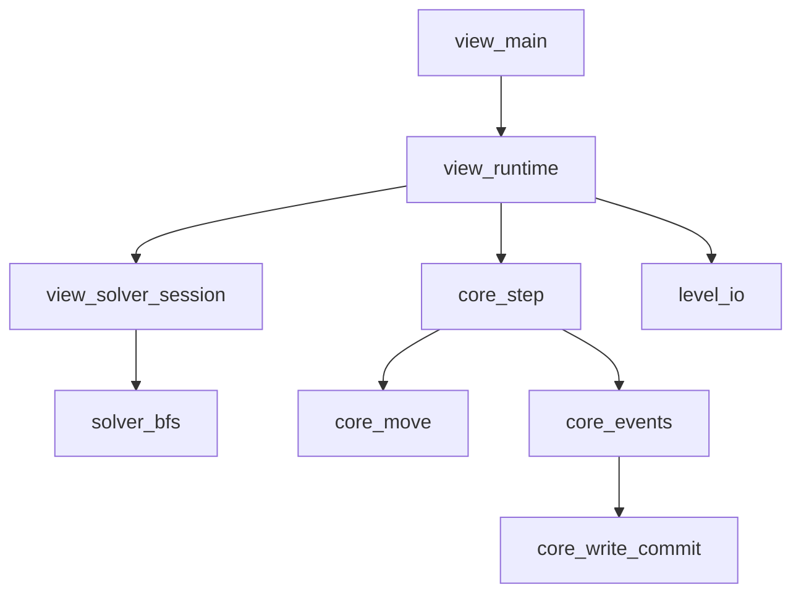

# SokobanSL Python 项目说明

## 快速开始

### 1) 环境要求
- Python 3.11+
- Windows / macOS / Linux（当前仓库在 Windows 上验证）

### 2) 安装依赖
```bash
python -m pip install pygame-ce pytest
```

### 3) 启动交互程序
```bash
python -m src.view.main
```

### 4) 运行测试
```bash
python -m pytest -q
```

---

## 目录速览

### 核心逻辑（非交互）
- `src/types.py`：核心数据结构定义（`State`、`StaticState`、`MonoData`、`Level` 等）。
- `src/state_utils.py`：状态深拷贝、深比较、冻结（哈希化）工具。
- `src/core_move.py`：同步移动与推动链逻辑。
- `src/core_events.py`：下降沿事件检测、S/L 读写轮次执行。
- `src/core_write_commit.py`：写聚合与冲突裁决（多数决，平票保留原值）。
- `src/core_step.py`：单步入口 `apply_action()`（移动 + 事件循环）。
- `src/goals.py`：目标判定。
- `src/solver_bfs.py`：BFS 生成器求解器。
- `src/level_io.py`：pickle 关卡读写、内置关卡导出。
- `src/sample_levels.py`：最小内置关卡样例。
- `src/disk_migration.py`：将磁盘 `data` 键从旧版世界坐标转为相对偏移（供一次性迁移脚本使用）。

### 交互层（view）
- `src/view/main.py`：程序入口。
- `src/view/runtime.py`：主循环（事件 -> 更新 -> 求解器推进 -> 渲染）。
- `src/view/input_router.py`：键鼠输入分发。
- `src/view/render.py`：极简方块渲染、坐标映射、视口缩放。
- `src/view/level_select.py`：选关态与关卡按钮处理。
- `src/view/preview.py`：预览栈逻辑。
- `src/view/solver_session.py`：求解器会话管理。
- `src/view/types.py`：`AppCtx`、`SolverSession` 状态容器。

### 测试
- `tests/test_core_rules.py`：移动、下降沿、写冲突用例。
- `tests/test_solver_bfs.py`：求解器协议与最小求解用例。

---

## 核心逻辑说明

### 数据模型
- `State = dict[Coord, MonoData | None]`
  - `value is None` 表示该坐标“无数据”。
- `StaticState`
  - `targets`：目标条件映射。
  - `buttons`：按钮映射（同坐标支持多个按钮）。
- `MonoData`
  - `is_empty / is_wall / is_controllable / color / data`。
  - `data` 用于磁盘记录态：键为**相对磁盘所在格的偏移**，世界格 = 磁盘位置 + 偏移；主关卡 `State` 的键仍为世界坐标。

### 单步状态更新
- 入口是 `src/core_step.py` 的 `apply_action(state, action, static_state)`。
- 执行链：
  1. `apply_movement()`：做同步移动。
  2. `run_event_cycle()`：处理下降沿触发的 S/L 事件，直到稳定。

### 事件与写提交
- 事件触发：`collect_edge_events()`，仅依赖 `is_empty` 的下降沿。
- 读写轮次：`build_event_writes()` 生成 `writes: list[State]`。
  - `S` 读取快照时，对每个相对键 `rel` 看世界格 `disk_pos+rel`；若该格当前为 `None`（无格/空），保留磁盘该 `rel` 的旧记录，不用 `None`/空气覆盖。
  - `L` 把磁盘 `data` 中每个非 `None` 值写回世界格 `disk_pos+rel`。
- 提交：`commit_writes()`
  - `None` 候选会被过滤。
  - 相同坐标按深比较分组计数，多数决生效。
  - 平票时保留旧值。

### 求解器
- `solve(initial_state, static_state, goal_predicate, step_chunk=1024)` 是生成器。
- 输出协议：
  - `("solving", steps, (), searched_state_count, elapsed_seconds)`
  - `("solved", steps, solution, searched_state_count, elapsed_seconds)`
  - `("no solution", max_depth, (), searched_state_count, elapsed_seconds)`
- 去重基于 `freeze_state()`。
- 当前实现已做两点性能优化：
  - BFS 队列保存父指针，找到解时再回溯路径，减少路径拷贝与内存压力。
  - `freeze_state()` 对同一坐标集合复用排序结果，减少重复排序开销。
- 另外，状态更新链路已从“全量深拷贝”改为“浅拷贝 + 局部写入”：
  - `apply_movement()` 与 `commit_writes()` 不再每步深拷贝整张状态图。
  - 推链检测不再为越界/未知坐标注入空气格，降低无效状态膨胀。
- 无效动作快路径：
  - `apply_movement()` 在无移动时直接返回原状态引用。
  - `apply_action()` 与 BFS 检测到“状态未变化”后直接跳过，避免冻结哈希与去重开销。

---

## 交互层说明

### 状态机
- `select_level`：选关态。
- `playing`：游玩态。

### 输入映射
- 选关态：
  - 鼠标左键：点击关卡按钮进入游玩。
  - `N`：导出内置关卡到 `data/levels/` 并刷新列表（每关一个 `.pkl` 文件）。
- 游玩态：
  - `Q` / `Esc`：返回选关。
  - `WASD` / 方向键：移动一步。
  - `R`：重置关卡（可被 `Z` 撤回）。
  - `Z`：撤回一步。
  - `H`：启动/重建求解器会话。
  - `L`：切换关卡编辑器模式（on/off）。
  - `Ctrl+S`：仅在编辑器模式开启时生效，覆盖保存当前关卡（保存当前 `state + static_state` 到当前关卡索引），并在界面下方显示一行 `Level Saved`，直到玩家下一次实质性操作。
  - 鼠标左键：按下-松开触发；若按下后横向或纵向移动超过半格，预览点击不会触发。

### 预览规则
- 点击非空气且 `data` 非空对象：压入一层预览（预览层内键为相对偏移，渲染时用 `anchor_world` 映射到世界格）。
- 点击空气 / None / 场外：弹出一层预览。
- 进行实质性操作（移动/重置/撤回）后会清空预览并停止求解器。

### 关卡编辑器模式
- 保留游玩态全部操作（移动、重置、撤回、求解器等）。
- 左键拖拽支持自动吸附到网格：
  - 若起点有状态物体（包括空气格），拖到终点会与终点状态物体交换；拖到右侧物品栏区域可删除该状态物体。
  - 空气格的细则：拖到 `value is None` 的格子后，起点会变为 `None`；拖到 `key not in state` 的格子或拖到右侧面板删除时，起点会直接从 `state` 字典移除。
  - 若起点无状态物体，则优先拖动按钮；按钮与目标重合时优先按钮；同格多个按钮会一起拖动。
  - 若既无状态物体也无按钮且有目标，则拖动目标；拖到右侧物品栏区域可删除。
- 将任意可拖动对象拖到右侧物品栏区域（任意位置）都会执行删除。
- 右侧面板提供无限取物：空气、无色墙、无色玩家、无色箱子、彩色 `S/L` 按钮、玩家目标、箱子目标。
- 右侧面板提供与颜色配套的有色磁盘（`D`）；默认 `data={(1,0):None}`（相对键，即磁盘东侧一格）。
- 每种颜色在 `D` 与 `S`/`L` 之间提供同色箱子目标（`BT cN`，`required_color=N`）；末尾仍有无色箱子目标 `BTarget`（`required_color=0`）。
- 编辑模式下右键：若无预览栈，在世界区域点击等同于将该格物体拖到右侧面板删除（与左键拖入删除区一致）；若存在磁盘预览栈，则在顶层预览中对当前格切换 `None`（不存在则添加，已存在则移除），并同步写回对应磁盘 `data`。
- 当右侧面板内容超出屏幕高度时，可用鼠标滚轮上下滚动。
- 彩色按钮条目按“关卡中已存在颜色 + 额外一个新颜色”动态生成，便于继续扩展新颜色。
- 编辑器对 `state/static_state` 的修改都计入撤回栈，`Z` 可逐步撤回。

### 渲染
- 采用极简方块渲染，不依赖图片素材。
- UI 字体会优先尝试系统中文字体（如微软雅黑/黑体），以支持中文关卡名显示。
- 视口策略：包围当前已知坐标并留边距，自动缩放。
- 图层顺序：世界层 -> 目标/按钮覆盖层 -> 预览层 -> 文本UI层。
- 求解器状态行颜色：
  - `solved` 显示为绿色。
  - `no_solution` 显示为红色。

---

## 使用说明（推荐流程）

1. 启动程序：`python -m src.view.main`
2. 如果选关页面为空，按 `N` 导出内置关卡。
3. 鼠标点击关卡进入游玩。
4. 使用 `WASD` / 方向键操作；`R` 重开；`Z` 撤回。
5. 需要提示时按 `H` 启动求解器进度显示。
6. 鼠标点击对象查看 `data` 预览，点击空处逐层退出。

---

## 常见问题

### 1) 运行后没有关卡可选
- 在选关态按 `N`，会导出内置关卡到 `data/levels/`。

### 1.1) 关卡名如何修改
- 关卡存档为 `data/levels/*.pkl`，文件名（不含后缀）就是选关界面显示的关卡名。
- 可在程序外直接重命名文件，回到选关并刷新后会显示新关卡名。

### 2) `python -m src.view.main` 启动失败
- 检查是否安装 `pygame-ce`：
  ```bash
  python -m pip install pygame-ce
  ```

### 3) 测试命令失败
- 确认 `pytest` 已安装：
  ```bash
  python -m pip install pytest
  ```
- 重新执行：
  ```bash
  python -m pytest -q
  ```

---

## 模块关系图



---

## 后续扩展建议
- 交互层加入单元测试（输入路由、预览栈、视口转换）。
- 支持可视化资源（sprite）与动画。
- 扩展关卡编辑与更多内置关卡。
