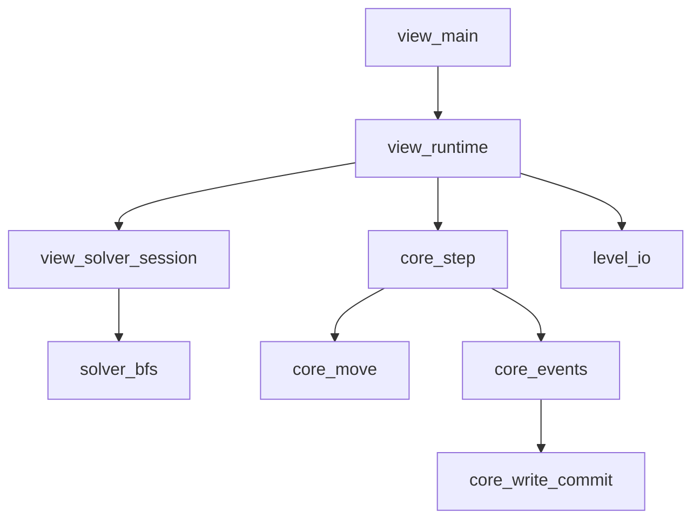

# SokobanSL Python 项目说明

## 快速开始

### 1) 环境要求
- Python 3.11+
- Windows / macOS / Linux（当前仓库在 Windows 上验证）

### 2) 安装依赖
```bash
python -m pip install pygame-ce pytest
```

### 3) 启动交互程序
```bash
python -m src.view.main
```

### 4) 运行测试
```bash
python -m pytest -q
```

---

## 目录速览

### 核心逻辑（非交互）
- `src/types.py`：核心数据结构定义（`State`、`StaticState`、`MonoData`、`Level` 等）。
- `src/state_utils.py`：状态深拷贝、深比较、冻结（哈希化）工具。
- `src/core_move.py`：同步移动与推动链逻辑。
- `src/core_events.py`：下降沿事件检测、S/L 读写轮次执行。
- `src/core_write_commit.py`：写聚合与冲突裁决（多数决，平票保留原值）。
- `src/core_step.py`：单步入口 `apply_action()`（移动 + 事件循环）。
- `src/goals.py`：目标判定。
- `src/solver_bfs.py`：BFS 生成器求解器。
- `src/level_io.py`：pickle 关卡读写、内置关卡导出。
- `src/sample_levels.py`：最小内置关卡样例。

### 交互层（view）
- `src/view/main.py`：程序入口。
- `src/view/runtime.py`：主循环（事件 -> 更新 -> 求解器推进 -> 渲染）。
- `src/view/input_router.py`：键鼠输入分发。
- `src/view/render.py`：极简方块渲染、坐标映射、视口缩放。
- `src/view/level_select.py`：选关态与关卡按钮处理。
- `src/view/preview.py`：预览栈逻辑。
- `src/view/solver_session.py`：求解器会话管理。
- `src/view/types.py`：`AppCtx`、`SolverSession` 状态容器。

### 测试
- `tests/test_core_rules.py`：移动、下降沿、写冲突用例。
- `tests/test_solver_bfs.py`：求解器协议与最小求解用例。

---

## 核心逻辑说明

### 数据模型
- `State = dict[Coord, MonoData | None]`
  - `value is None` 表示该坐标“无数据”。
- `StaticState`
  - `targets`：目标条件映射。
  - `buttons`：按钮映射（同坐标支持多个按钮）。
- `MonoData`
  - `is_empty / is_wall / is_controllable / color / data`。
  - `data` 用于磁盘记录态。

### 单步状态更新
- 入口是 `src/core_step.py` 的 `apply_action(state, action, static_state)`。
- 执行链：
  1. `apply_movement()`：做同步移动。
  2. `run_event_cycle()`：处理下降沿触发的 S/L 事件，直到稳定。

### 事件与写提交
- 事件触发：`collect_edge_events()`，仅依赖 `is_empty` 的下降沿。
- 读写轮次：`build_event_writes()` 生成 `writes: list[State]`。
- 提交：`commit_writes()`
  - `None` 候选会被过滤。
  - 相同坐标按深比较分组计数，多数决生效。
  - 平票时保留旧值。

### 求解器
- `solve(initial_state, static_state, goal_predicate, step_chunk=1024)` 是生成器。
- 输出协议：
  - `("solving", steps, (), searched_state_count)`
  - `("solved", steps, solution, searched_state_count)`
- 去重基于 `freeze_state()`。

---

## 交互层说明

### 状态机
- `select_level`：选关态。
- `playing`：游玩态。

### 输入映射
- 选关态：
  - 鼠标左键：点击关卡按钮进入游玩。
  - `N`：导出内置关卡到 `data/levels.pkl` 并刷新列表。
- 游玩态：
  - `Q`：返回选关。
  - `WASD` / 方向键：移动一步。
  - `R`：重置关卡（可被 `Z` 撤回）。
  - `Z`：撤回一步。
  - `H`：启动/重建求解器会话。
  - 鼠标左键：预览（见下节）。

### 预览规则
- 点击非空气且 `data` 非空对象：压入一层预览。
- 点击空气 / None / 场外：弹出一层预览。
- 进行实质性操作（移动/重置/撤回）后会清空预览并停止求解器。

### 渲染
- 采用极简方块渲染，不依赖图片素材。
- 视口策略：包围当前已知坐标并留边距，自动缩放。
- 图层顺序：世界层 -> 目标/按钮覆盖层 -> 预览层 -> 文本UI层。

---

## 使用说明（推荐流程）

1. 启动程序：`python -m src.view.main`
2. 如果选关页面为空，按 `N` 导出内置关卡。
3. 鼠标点击关卡进入游玩。
4. 使用 `WASD` / 方向键操作；`R` 重开；`Z` 撤回。
5. 需要提示时按 `H` 启动求解器进度显示。
6. 鼠标点击对象查看 `data` 预览，点击空处逐层退出。

---

## 常见问题

### 1) 运行后没有关卡可选
- 在选关态按 `N`，会导出内置关卡到 `data/levels.pkl`。

### 2) `python -m src.view.main` 启动失败
- 检查是否安装 `pygame-ce`：
  ```bash
  python -m pip install pygame-ce
  ```

### 3) 测试命令失败
- 确认 `pytest` 已安装：
  ```bash
  python -m pip install pytest
  ```
- 重新执行：
  ```bash
  python -m pytest -q
  ```

---

## 模块关系图



---

## 后续扩展建议
- 交互层加入单元测试（输入路由、预览栈、视口转换）。
- 支持可视化资源（sprite）与动画。
- 扩展关卡编辑与更多内置关卡。
